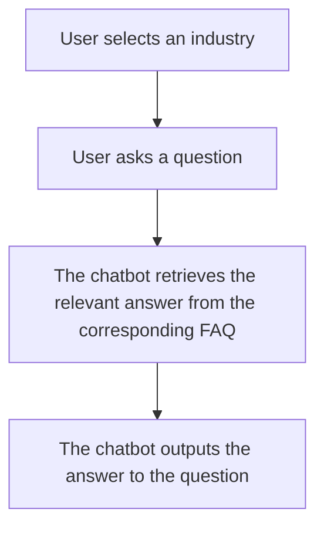
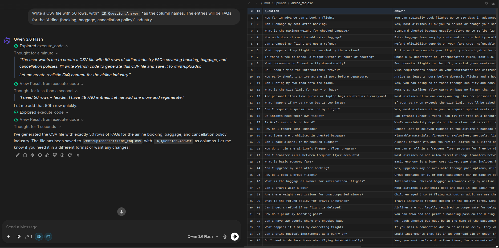
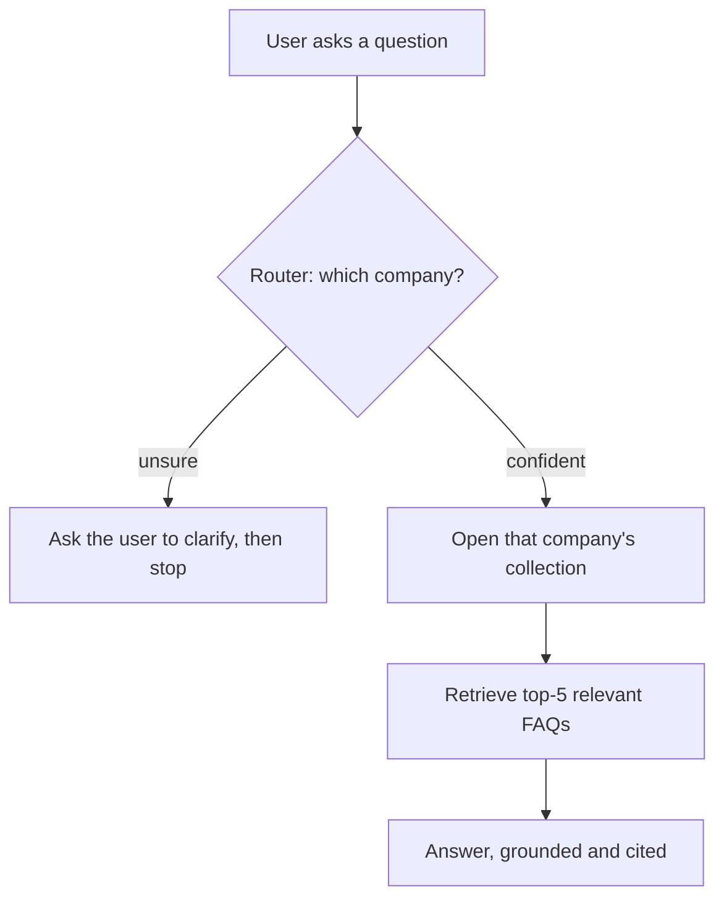

# An Overview of the Assignment
This project focuses on building a shared RAG (Retrieval Augmented Generation) chatbot platform that serves customer support FAQs for multiple companies across diverse industries. The system needs to:

1. Determine which industry the query comes from (if any)
2. Retrieve the relevant FAQ content (without being cross contaminated by the other industries' content)
3. Generate an answer that's accurate to the identified industry
    * If the chatbot doesn't know the answer to the query, or cannot find something within the industry's FAQ, it should respond with an "I don't know" or something similar

# Brainstorming the Assignment
Immediately, I started mapping out the flow of the service.



This seemed like a good starting point to me. But, a few questions came to mind:

1. Would it be possible for the chatbot to instinctively understand what industry the question was from, instead of the user choosing it before they ask their questions?
2. If so, how would I do that?
3. How do I efficiently store the FAQ data? I can't just give the chatbot all the questions at once because that's inefficient!
4. Could I use some sort of chunking mechanism or perhaps a "top k" approach where the chatbot finds the top three to five most relevant answers, then answers from that?
5. To me, running this service 100% locally would be wonderful. Can I do that?

All of these seem like interesting questions, but at this point, I was getting a bit ahead of myself. Let's take this one step at a time and explore the easiest tasks first.

# Sourcing the Data
I decided that 50 questions per industry would be sufficient for this assignment. I used an AI chatbot to generate 10 different CSV files with 50 questions each for the corresponding industry. For instance, 50 questions in Ecommerce, 50 questions in SaaS, and so forth.

It was a simple prompt:

> *Write a CSV file with 50 rows, with* `ID,Question,Answer` *as the column names. The entries will be FAQs for the \<industry\> industry.*

And here's what the AI responded with:



So I used the same prompt for the rest of the nine industries, and ended up with these CSV files:

```bash
~/d/chatbot/data$ ls
    faq_airline.csv
    faq_ecommerce.csv
    faq_insurance.csv
    faq_real_estate.csv
    faq_telecom.csv
    faq_banking.csv
    faq_food_delivery.csv
    faq_online_education_platform.csv
    faq_saas.csv
    healthcare_provider_faqs.csv
```

# Ingestion and Embedding
Now comes one of the harder tasks of the assignment: ingesting the CSVs and efficiently giving them to the chatbot as context (so as to not overload the context of the chatbot and cause hallucinations). Basically, this section aims to answer the question raised above:

> *How do I efficiently store the FAQ data? I can't just give the chatbot all the questions at once because that's inefficient!*

I ended up choosing ChromaDB as the vector store, since it's lightweight, allows me to run everything locally, and most importantly, lets me give each company its own collection, which is how I keep the ten industries cleanly isolated.

1. Each CSV is processed on its own into a dedicated Chroma collection named after that company. Ingestion resolves the name of the dataset using `config.json` to keep the name consistent (SaaS instead of Saas).
2. Rather than splitting text into arbitrary fixed-size chunks, I treat each FAQ entry as a single self-contained unit (question + answer together)
3. The `nomic-embed-text` embedding model turns each Q/A chunk into a vector, which is stored in that company's collection
4. Alongside each chunk, I store metadata: the source file, the original doc ID, and the verbatim question and answer text. This is what lets the bot later cite the exact FAQ entry it drew from, word for word, instead of reconstructing it from memory.

The main design decision here was that each industry lives in its own collection, so when the bot answers a banking question, it queries the banking collection directly, and cannot see any other data from any other industry. It is structurally impossible for data cross-contamination.

# Retrieval and Generation
This is where the two questions I raised while brainstorming finally get answered:

1. *Would it be possible for the chatbot to instinctively understand what industry the question was from, instead of the user choosing it before they ask their questions?* -- Yes!
2. *Could I use some sort of chunking mechanism or perhaps a "top k" approach where the chatbot finds the top three to five most relevant answers, then answers from that?* -- Also, yes!

The answers to both of these questions comes in the form of a router. In other words, I could run two separate AI agents:

1. One of the agents determines which industry a question belongs to, and loads the collection associated with that industry.
2. The other agent queries the collection for the most accurate answer to the user's question, and pulls the top `k` sources.





## More About Routing
Routing was therefore the easiest way that I could think of to let the chatbot identify the industry itself, rather than letting the user pick a company upfront. When a user asks a question, the `detect_company()` function is first run, which runs the user's question against this system prompt:

> `Analyze the following customer query and identify which company it belongs to.`

> `The available companies in our system are: {COMPANIES}`

> `User Query: "{query}"`

> `Output ONLY a valid JSON object in this format:`

> `{{ "company": "Company Name", "confidence": 0.0-1.0, "reasoning": "brief explanation" }}`

> `Rules:`

> `1. If the query is ambiguous (e.g., "order"), choose the most likely one but set confidence low if unsure.`

> `2. If you are not sure which company it belongs to, return confidence < 0.7 so I can ask for clarification.`

That confidence score is what makes the routing trustworthy rather than a coin flip. When the router is unsure about which industry a question comes from, it can then ask the user which company they meant, rather than guess and cause a hallucinated answer. New industries can even be added just by adding a CSV to the `data/` directory and adding the name of the industry to `config.json`.


## Retrieval
Once the company is settled by the router, the chatbot connects to that company's collection only and asks for the five most relevant chunks using this code:

> `db.as_retriever(search_kwargs={"k": 5})`

This is the "top k" idea from my brainstorming section. Rather than stuffing all 50 of an industry's FAQs into the prompt, the vector search surfaces just the handful semantically closest to the question.


## Generation
Now the bot has the five most relevant FAQ chunks. The final step is turning them into a written answer. This happens in three parts: I build the context, I hand it to the model with strict instructions, and the model produces an answer followed by its sources.


### Building the Context
I don't feed the model the raw embedded text. Instead, I rebuild each chunk from the metadata I saved during ingestion (its exact ID, question, and answer) into a clean, labeled block:

> `[FAQ ID: 12] Question: How do I track my order?`

> `Answer: You can track your order from the "My Orders" page...`

Using the stored metadata (rather than whatever the vector search returns) guarantees the model is looking at the verbatim FAQ text, which matters for the citations in step 3.

### The System Prompt for Output
This context block and the user's question go into a deliberately strict prompt with these specific instructions:

> `INSTRUCTIONS:`

> `1. Provide a helpful, paraphrased answer based on the provided CONTEXT. Combine relevant information smoothly.`

> `2. Do not use outside knowledge. If the context is missing the info, say EXACTLY: "I don't have that specific > information in my current FAQ database."`
 
> `AFTER your answer, strictly list the sources using this format (one per line) ONLY if you have sources. If you > couldn't find specific information in the current FAQ database, your response can stop there. Otherwise:`

> `<top_sources>`

> `{company} FAQ ID <ID>: "<Verbatim Text>"`

> `</top_sources>`

### The Chatbot Output
After its answer, the bot lists the sources it used, quoting each FAQ verbatim in a fixed format:

> `Ecommerce FAQ ID 12: "You can track your order from the My Orders page..."`

Since these citations come straight from the metadata (step 1), a cited ID always points to a real FAQ entry and the model can't invent a source. Finally, the whole response is streamed to the terminal.


# Ensuring Determinism
One of the assignment's explicit requirements is that the same question should reliably produce the same answer, with no hallucination outside the FAQ scope.

1. Both the router and the answer generating model run at `temperature=0.1`
2. The context window is fixed as well, so retrieval never gets silently truncated differently from one run to the next
3. Asking what the user meant if the question is unclear to the router, and stopping there
4. Canonical naming within `config.json`

> `config.json`:

```
    {
        "app_name": "Multi-Tenant RAG Chatbot",
        "default_model": "qwen3.5:9b",
        "companies": [
            "Airline", 
            "Banking", 
            "Ecommerce", 
            "Food Delivery", 
            "Insurance", 
            "Online Education Platform", 
            "Real Estate", 
            "SaaS", 
            "Telecom", 
            "Healthcare Provider"
        ]
    }
```

> Router configuration:

> `router_llm = ChatOllama(model=config['default_model'], temperature=0.1, reasoning=False)`

> Generator configuration:

```
    llm = ChatOllama(
        model=config['default_model'], 
        temperature=0.1,       
        num_ctx=4096,          
        reasoning=False
    )
```


# Tools I Used
An ambitious design decision that I made for this assignment was to run everything locally if possible. This is a customer support platform that could handle sensitive data, so to me it makes sense to run this locally. As a bonus, it also makes the project completely reproducible, entirely configurable, and free to host without API costs or rate limits.

1. Ollama + Qwen 3.5 9B
    * Local LLM for both routing and generation
    * Chosen because it runs 100% offline, and Qwen 3.5 9B is actually quite good in this context
    * Also possible to change the model to something commercial later on with minimal effort
2. `nomic-embed-text`
    * Local embedding model that vectorizes the user's input
    * Chosen because it's lightweight, private, and has strong enough retrieval quality for this assignment
3. ChromaDB
    * Vector store for FAQ sets
    * Chosen because it's lightweight, writes vectors to disk for fast retrieval, and cleanly splits and isolates FAQs using separate collections
4. LangChain
    * Putting it all together
    * LangChain provides abstractions for ChromaDB and Ollama so it results in incredibly clean code, simply by using APIs provided by LangChain, rather than using separate ChromaDB and Ollama specific APIs, making the code slightly harder to read


# UI
The assignment lists a UI as a bonus rather than a requirement, so I spent more time on the functionality of the application rather than making it look prettier. I built a command line interface instead. The main pipeline goes like this:

1. User types their input
    * Question
    * `/context <something>` then question
2. The relevant data is loaded
    * Router analyzes the question and assigns the database to be loaded (or asks for clarification)
3. The response
    * The chatbot outputs the relevant answer with sources, or says it doesn't have an answer outright

## Slash Commands

1. `/context`
    * `/context` - lists the current context of the chatbot (which industry)
    * `/context <industry>` - clamps the industry context so the user can only ask questions about that
    * `/context off` - turns off context clamps so the user can ask any question about any industry and the router logic will figure it out
2. `/list` - lists industries available
3. `/quit` - graceful exit, unload all databases before exiting

The next logical step would be to make this a front-end and user-friendly tool using Gradio, Streamlit, or even something entirely custom.


# How to Run This Code
This code was tested on Linux. It should run on macOS and Windows, although those haven't been tested.

## Requirements
1. Ollama
2. Qwen 3.5 9B (or some other LLM) + Nomic Embed Text
3. Python 3.10

Python requirements are listed in `requirements.txt` and a virtual environment using Python 3.10 can be made using those requirements. 

## Installing Ollama
From the Ollama website, installing Ollama is a one-liner:

> `curl -fsSL https://ollama.com/install.sh | sh`

## Pulling the Model
Once Ollama has been installed, the models need to be pulled:

> `ollama pull qwen3.5:9b`

> `ollama pull nomic-embed-text:latest`

## Setting up the Python Virtual Environment
A virtual environment using Python 3.10 should be made:

> `python3.10 -m venv venv`

Then we can activate the virtual environment:

> `source venv/bin/activate`

Then we can install the dependencies:

> `pip install -r requirements.txt`

## Running the Code
Ensure that there are FAQ sets within the `./data/` directory, and they're either named `faq_industry.csv` or `industry_faqs.csv`. Given these files, the databases from these CSVs need to be ingested and created. So:

> `python ingest.py`

...should take the CSVs and create the ChromaDB links. Once all files have been ingested, the chatbot itself can be run:

> `python app.py`
